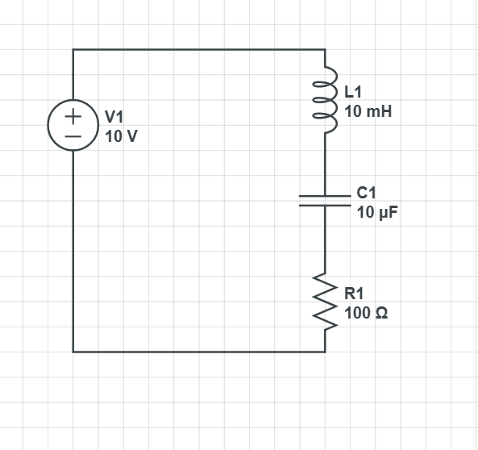
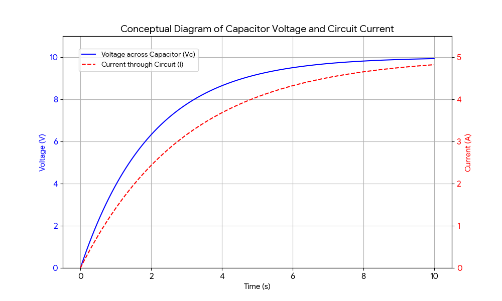

# RLC Circuit Simulation

This project simulates a simple **RLC series circuit** using CircuitLab.

## 🔧 **Components Used**
- **Resistor (R1):** 100 Ω
- **Inductor (L1):** 10 mH
- **Capacitor (C1):** 100 μF
- **DC Voltage Source (V1):** 10 V

---

## ⚡ **Objective**
To observe the **transient response** of an RLC series circuit when connected to a DC supply.

---

## 📝 **Procedure**

1. **Designed the circuit** in [CircuitLab](https://www.circuitlab.com/editor/):
   - Placed DC voltage source, resistor, inductor, and capacitor in **series connection**.
   - Connected **Ground** at the negative terminal for proper simulation.

2. **Configured component values**:
   - Resistor: 100 Ω  
   - Inductor: 10 mH  
   - Capacitor: 100 μF  
   - Voltage source: 10 V DC

3. Ran **Time Domain (Transient) Simulation** with:
   - Stop Time: 0.1 s  
   - Time Step: automatic or 1 μs

4. Plotted:
   - **Voltage across capacitor (C1.v)**
   - **Current through resistor (R1.i)**

---

## 🔍 **Observations**

- **Capacitor voltage** rises exponentially to supply voltage (10V).
- **Inductor current** increases gradually, opposing sudden changes due to inductive reactance.
- The circuit reaches **steady-state** with capacitor fully charged and inductor acting as a short.

---

## 📷 **Circuit Diagram**

---

## 📈 **Simulation Results**

---

## 💡 **Concepts Learned**
- Transient behaviour of RLC circuits.
- Role of capacitor charging and inductor current build-up in DC circuits.
- Using CircuitLab for circuit design and simulation.

---

## 🔗 **References**
- [CircuitLab Online Simulator](https://www.circuitlab.com/editor/)
- [RLC Circuit Theory - Electronics Tutorials](https://www.electronics-tutorials.ws/accircuits/series-rlc-circuit.html)

---

### ✨ **Author**
👤 **suv4tha**

---
